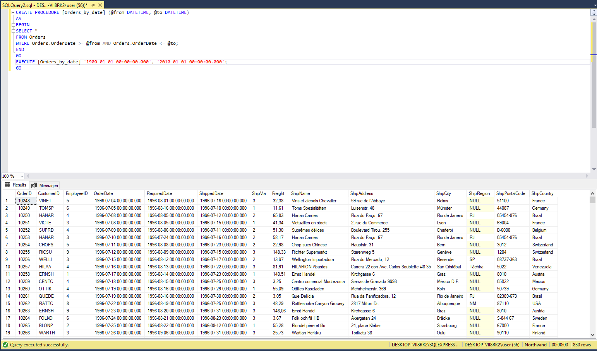
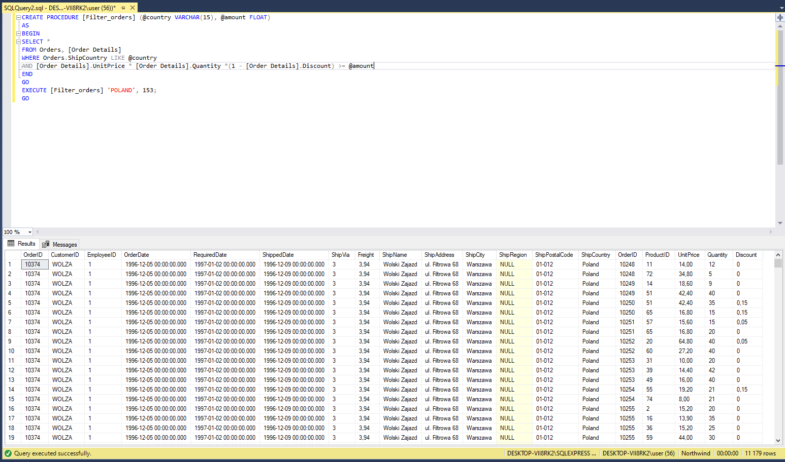
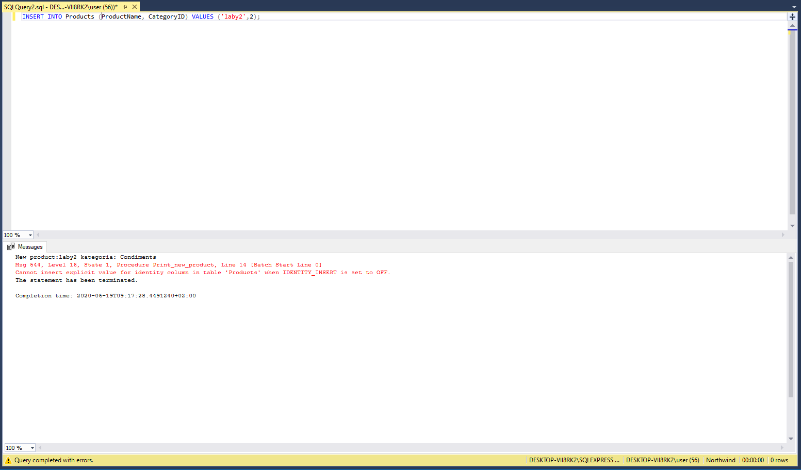
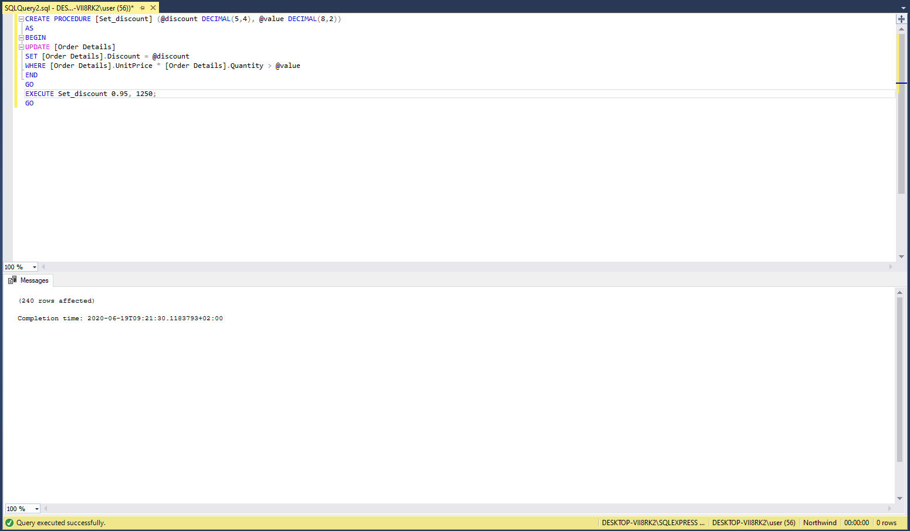
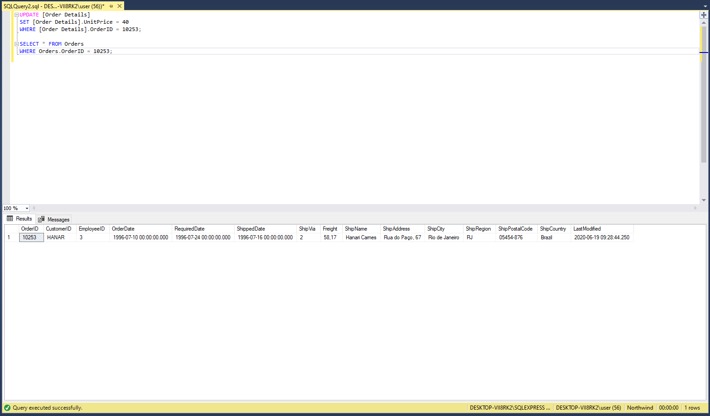
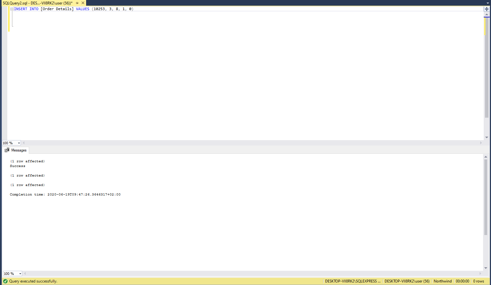
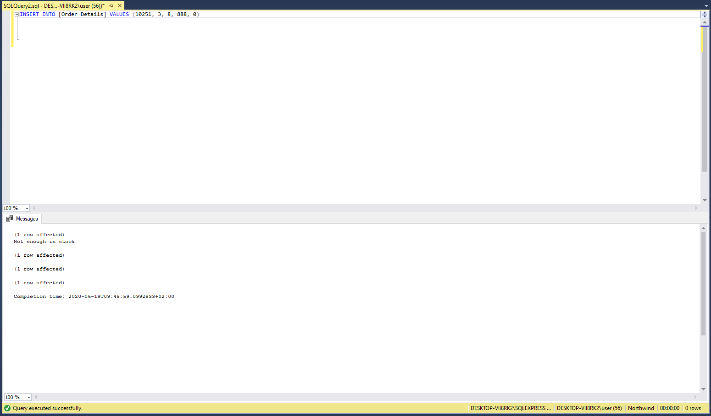
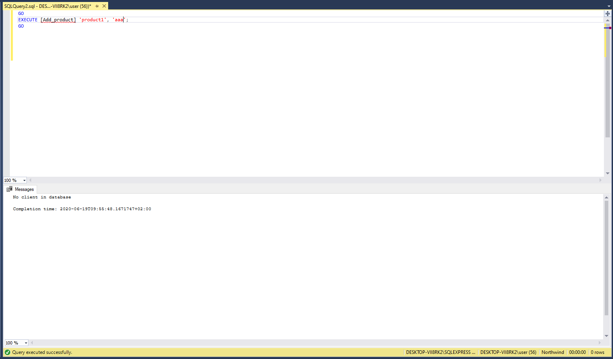

## SQL#5  

### 1. SKONSTRUUJ PROCEDURĘ WYŚWIETLAJĄCĄ INFORMACJE O ZAMÓWIENIACH DOKONANYCH POMIĘDZY PODANYMI DATAMI. ZADEMONSTRUJ DZIAŁANIE PROCEDURY.

```
CREATE PROCEDURE [Orders_by_date] (@from DATETIME, @to DATETIME)
AS
BEGIN
SELECT *
FROM Orders
WHERE Orders.OrderDate >= @from AND Orders.OrderDate <= @to;
END
```



### 2. SKONSTRUUJ PROCEDURĘ WYŚWIETLAJĄCĄ INFORMACJE O ZAMÓWIENIACH DOSTARCZANYCH DO KRAJU, KTÓREGO NAZWA ZAWIERA PODANĄ FRAZĘ ORAZ WARTOŚCI WIĘKSZEJ NIŻ (RÓWNIEŻ) PODANA. ZADEMONSTRUJ DZIAŁANIE PROCEDURY.

```
CREATE PROCEDURE [Filter_orders] (@country VARCHAR(15), @amount FLOAT)
AS
BEGIN
SELECT *
FROM Orders, [Order Details]
WHERE Orders.ShipCountry LIKE @country
AND [Order Details].UnitPrice * [Order Details].Quantity *(1 - [Order Details].Discount) >= @amount
END
```



### 3.  ZAPROJEKTUJ WYZWALACZ WYPISUJĄCY (PRINT) NAZWĘ PRODUKTU ORAZ NAZWĘ KATEGORII PO KAŻDORAZOWYM DODANIU NOWEGO PRODUKTU DO TABELI ‘Products’. ZADEMONSTRUJ DZIAŁANIE WYZWALACZA.

```
CREATE TRIGGER [Print_new_product]
ON Products
AFTER INSERT
AS
DECLARE @productName VARCHAR(40)
DECLARE @categoryID INT
DECLARE @categoryName VARCHAR(15)
SELECT @productName = inserted.ProductName, @categoryID = inserted.CategoryID
FROM inserted
SELECT @categoryName = Categories.CategoryName
FROM Categories
WHERE Categories.CategoryID = @categoryID
PRINT 'New product:' + @productName + ' kategoria: ' + @categoryName;
```



### 4.  SKONSTRUUJ PROCEDURĘ USTAWIAJĄCĄ RABAT (Discount) O PODANEJ WYSOKOŚCI PRODUKTOM, KTÓRYCH WARTOŚĆ (CENA JEDNOSTKOWA ● ILOŚĆ) JEST WIĘKSZA NIŻ PODANA WARTOŚĆ. ZADEMONSTRUJ DZIAŁANIE PROCEDURY.

```
CREATE PROCEDURE [Set_discount] (@discount DECIMAL(5,4), @value DECIMAL(8,2))
AS
BEGIN
UPDATE [Order Details]
SET [Order Details].Discount = @discount
WHERE [Order Details].UnitPrice * [Order Details].Quantity > @value
END
```



### 5.  DODAJ NOWĄ KOLUMNĘ DO TABELI ‘Orders’ O NAZWIE ‘LastModified’ PRZECHOWUJĄCĄ DATĘ OSTATNIEJ MODYFIKACJI ZAMÓWIENIA. NASTĘPNIE ZAPROJEKTUJ WYZWALACZ UAKTUALNIAJĄCY DATĘ MODYFIKACJI ZAMÓWIENIA W ODPOWIEDZI NA JAKĄKOLWIEK ZMIANĘ (INSERT, UPDATE, DELETE) W TABELI ‘Order Details’ (DOTYCZĄCĄ DANEGO ZAMÓWIENIA). ZADEMONSTRUJ DZIAŁANIE WYZWALACZA.
```
ALTER TABLE Orders
ADD LastModified DATETIME;
```
```
CREATE TRIGGER [Lastmodified]
ON [Order Details]
AFTER INSERT, UPDATE, DELETE
AS
DECLARE @ID INT
IF EXISTS (
SELECT *
FROM deleted
)
BEGIN
SELECT @ID = deleted.OrderID
FROM deleted
END
ELSE
BEGIN
SELECT @ID = inserted.OrderID
FROM inserted
END
UPDATE Orders
SET Orders.LastModified = GETDATE()
WHERE Orders.OrderID = @ID;
```




### 7.  ZAPROJEKTUJ WYZWALACZ, KTÓRY PRZED DODANIEM NOWEGO PRODUKTU DO ZAMÓWIENIA SPRAWDZI CZY LICZBA ZAMAWIANYCH SZTUK NIE PRZEKRACZA BIEŻĄCEGO STANU MAGAZYNOWEGO (UnitsInStock). JEŻELI W MAGAZYNIE NIE MA WYSTARCZAJĄCEJ LICZBY SZTUK ZAMAWIANEGO PRODUKTU TRANSAKCJĘ NALEŻY WYCOFAĆ, W PRZECIWNYM PRZYPADKU NALEŻY UAKTUALNIĆ STAN MAGAZYNOWY ORAZ DODAĆ PRODUKT DO ZAMÓWIENIA. ZADEMONSTRUJ DZIAŁANIE WYZWALACZA.

```
CREATE TRIGGER [In_stock]
ON [Order Details]
AFTER INSERT
AS
DECLARE @amountWanted INT
DECLARE @amountStock INT
DECLARE @productID INT
DECLARE @orderID INT

SELECT @amountWanted = inserted.Quantity, @productID = inserted.ProductID,
@orderID = inserted.OrderID
FROM inserted
SELECT @amountStock = Products.UnitsInStock
FROM Products
WHERE Products.ProductID = @productID
IF @amountWanted > @amountStock
BEGIN
PRINT 'Not enough in stock'
DELETE FROM [Order Details]
WHERE [Order Details].ProductID = @productID
AND [Order Details].OrderID = @orderID

END
ELSE
BEGIN
PRINT 'Success'
UPDATE Products
SET Products.UnitsInStock =
Products.UnitsInStock - @amountWanted
WHERE Products.ProductID = @productID
END
```





### 8. SKONSTRUUJ PROCEDURĘ DODAJĄCĄ PRODUKT (O PODANEJ NAZWIE) DO ZAMÓWIENIA KLIENTA (O PODANEJ NAZWIE FIRMY). JEŻELI DANY KLIENT NIE POSIADA ŻADNYCH ZAMÓWIEŃ, TO UTWÓRZ NOWE PRZYPISUJĄC DO NIEGO PRACOWNIKA, KTÓRY „OBSŁUGUJE” NAJMNIEJ ZAMÓWIEŃ. W PRZYPADKU GDY KLIENT POSIADA ZAMÓWIENIA, TO DODAJ PRODUKT DO TEGO, KTÓRE ZAWIERA NAJMNIEJ PRODUKTÓW. ZADEMONSTRUJ DZIAŁANIE PROCEDURY.

```
CREATE PROCEDURE [Add_product] (@productName VARCHAR(40), @companyName
VARCHAR(40))
AS
BEGIN
DECLARE @productID INT
DECLARE @orderID INT
DECLARE @categoryID VARCHAR(50)
SELECT @productID = Products.ProductID
FROM Products
WHERE Products.ProductName LIKE @productName
IF EXISTS (
SELECT Customers.CustomerID
FROM Customers
WHERE Customers.CompanyName LIKE @companyName
)
BEGIN
SELECT @categoryID = Customers.CustomerID
FROM Customers
WHERE Customers.CompanyName LIKE @companyName
IF EXISTS (
SELECT Orders.OrderID
FROM Orders
WHERE Orders.CustomerID = @categoryID
)
BEGIN
SELECT TOP 1 @orderID = [Order Details].OrderID
FROM [Order Details]
GROUP BY [Order Details].OrderID
ORDER BY COUNT([Order Details].OrderID) ASC;
INSERT INTO [Order Details] (OrderID, ProductID)
VALUES (@orderID, @productID)

END
ELSE
BEGIN
DECLARE @employeeID INT
SELECT TOP 1 @employeeID = Orders.EmployeeID
FROM Orders
GROUP BY Orders.EmployeeID
ORDER BY COUNT(Orders.EmployeeID) ASC;
DECLARE @newOrderID INT
SELECT TOP 1 @newOrderID = Orders.OrderID
FROM Orders
ORDER BY Orders.OrderID DESC
SET @newOrderID = @newOrderID + 1
INSERT INTO Orders (OrderID, CustomerID, EmployeeID)
VALUES (@newOrderID, @categoryID, @employeeID)
INSERT INTO [Order Details] (OrderID, ProductID)
VALUES (@newOrderID, @productID)

END
END
ELSE
BEGIN
PRINT 'No client in database'
END

END
```



