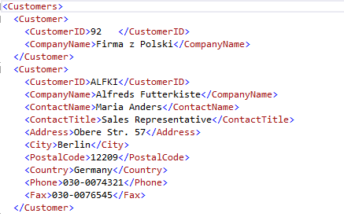
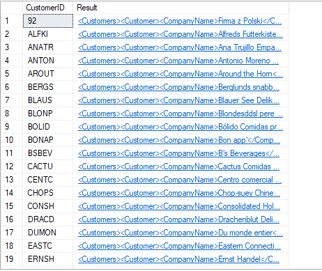
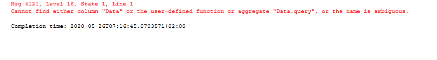
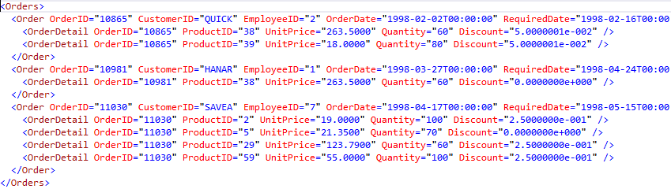

## SQL#5 zestaw: `bd_lab_6_exercises.pdf`  

### 1. Wypisz wszystkie informacje o klientach (z tabeli Customers) w postaci dokumentu XML (PATH, ROOT, XMLNAMESPACES).

```
SELECT * FROM Customers
FOR XML PATH('Customer'), ROOT ('Customers')
```



### 2. Utwórz nową tabelę o nazwie XmlCustomers (nie korzystaj z CREATE TABLE) zawierającą dwie kolumny — identyfikator klienta oraz wszystkie inne dane zapisane w postaci dokumentu xml (posortuj dane według nazwy kraju) (CAST).

```
SELECT CustomerID, CAST (
	(
		SELECT CompanyName, ContactName, ContactTitle, Address, City, Region, PostalCode, Country, Phone, Fax
		FROM Customers AS B
		WHERE A.CustomerID = B.CustomerID
		FOR XML PATH ('Customer'), ROOT('Customers')
	)
	AS XML
	)
AS Result INTO XmlCustomers 
FROM Customers AS A
ORDER BY Country
SELECT *
FROM XmlCustomers 
```



### 3.  Utwórz zapytanie zwracające nazwy firm oraz nazwy kontaktów z tabeli XmlCustomers.

```
SELECT
  Data.query('element Result { /Customers/Customer/CompanyName}') AS CompanyName
  Data.query('element Result { /Customers/Customer/ContactTitle}') AS ContactTitle
FROM XmlCustomers
```



### 4.  Korzystając tylko z tabeli XmlCustomers wyświetl nazwy firm oraz kontaktów, ale uwzględniając tylko firmy z Polski oraz Hiszpanii. Dodatkowo dodaj „korzeń” o nazwie <Customers>.

```
SELECT
Data.query('element Result { /Customers/Customer/CompanyName}') AS CompanyName
Data.query('element Result { /Customers/Customer/ContactTitle}') AS ContactTitle
FROM XmlCustomers
WHERE Data.query('element Result { /Customers/Customer/Country}[1]', 'VARCHAR(20)') = 'Poland' OR Data.query('element Result { /Customers/Customer/Country}[1]', 'VARCHAR(20)') = 'Spain'
FOR XML PATH ('Customer'), ROOT ('Customers')
```


### 5.  Skonstruuj zapytanie wyświetlające klientów tylko z Niemiec w postaci pokazanej poniżej (tylko tabela XmlCustomers).

```
SELECT
Data.query('element Result {attribute identyfikator{ /Customers/Customer/CustomerID}, element Nazwa {string(( /Customers/Customer/CompanyName)[1])}, element Miasto {string(( /Customers/Customer/City)[1])},')
FROM XmlCustomers
WHERE Data.query('element Result { /Customers/Customer/Country}[1]', 'VARCHAR(20)') = 'Germany'
FOR XML PATH ('Klient'), ROOT ('Klienci')
```


### 6.  Utwórz zapytanie wyświetlające dokument XML zawierający informacje o zamówieniach (tabele Orders oraz Order Details), których całkowita wartość przekroczyła 15000 (piętnaście tysięcy).

```
SELECT *
FROM Orders AS [Order]
JOIN [Order Details] AS OrderDetail ON [Order].OrderID = OrderDetail.OrderID
WHERE OrderDetail.OrderID IN (
	SELECT suma.OrderID
	FROM [Order Details] AS suma
	GROUP BY suma.OrderID HAVING SUM(suma.Quantity * suma.UnitPrice) > 15000)
FOR XML AUTO, ROOT('Orders')
```




